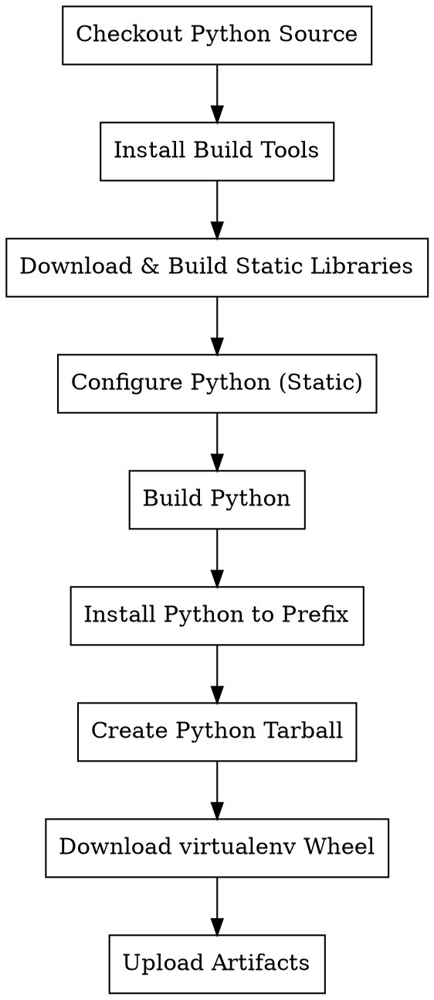

# UOS Python 静态构建设计文档

## 背景

目标操作系统：统信 UOS 20（基于 Debian 10）
- glibc 版本：2.28（无法升级）
- 内网环境，无法安装或升级依赖包
- 需要完全自包含的 Python 二进制包

## 目标

通过 GitHub Actions 在 Debian 10 容器中构建：
1. 完全自包含的 Python 3.14.5 二进制包（tar.gz 格式）
2. virtualenv wheel 包（单独打包）

## 技术方案

### 完全静态链接策略

Python 支持完全静态构建模式，通过以下配置实现：

```bash
export MODULE_BUILDTYPE=static
export PY_UNSUPPORTED_OPENSSL_BUILD=static
./configure --disable-shared --with-static-libpython ...
```

**核心原理**：
- `MODULE_BUILDTYPE=static`：所有扩展模块静态链接到 Python 二进制
- `PY_UNSUPPORTED_OPENSSL_BUILD=static`：OpenSSL 静态链接（Python 3.14+ 支持）
- `--disable-shared`：不生成 libpython 动态库
- `--with-static-libpython`：将 libpython 静态链接到解释器

### 静态库编译清单

| 库名称 | 版本 | 构建方式 | Python 模块 |
|--------|------|---------|-------------|
| zlib | 1.2.13 | `./configure --static && make` | zlib |
| bzip2 | 1.0.8 | 直接编译生成 `.a` | bz2 |
| xz (lzma) | 5.4.1 | `./configure --disable-shared` | lzma |
| zstd | 1.5.5 | `cmake -DBUILD_SHARED_LIBS=OFF` | zstd |
| OpenSSL | 1.1.1w | `./Configure no-shared no-dso -fPIC` | ssl, hashlib |
| libffi | 3.4.4 | `./configure --disable-shared --with-pic` | ctypes |
| ncurses | 6.4 | `./configure --without-shared --with-pic` | curses |
| readline | 8.2 | `./configure --disable-shared --with-pic` | readline |
| sqlite3 | 3.41.0 | `./configure --disable-shared` | sqlite3 |
| mpdecimal | 2.5.1 | `./configure --disable-shared` | decimal |
| gdbm | 1.23 | `./configure --disable-shared` | dbm, gdbm |

### glibc 依赖说明

唯一的外部依赖是 glibc，这是技术上无法避免的：
- glibc 不支持静态链接（会破坏系统调用接口）
- 但这不是问题：Debian 10 的 glibc 2.28 与 UOS 20 完全相同
- Python 二进制在 UOS 20 上可直接运行，无需额外依赖

## 工作流设计

### 文件位置

`.github/workflows/build-uos.yml`

### 触发方式

```yaml
on:
  push:
    branches:
      - main
  workflow_dispatch:
    inputs:
      tag:
        description: 'Python version tag to build (e.g., v3.14.5)'
        required: false
        type: string
        default: ''
```

### Checkout 策略

```yaml
- uses: actions/checkout@v4
  with:
    ref: ${{ inputs.tag || github.ref }}
    fetch-depth: 0
```

**逻辑**：
- push 到 main：使用 main 分支最新提交
- workflow_dispatch：使用指定的 tag，或默认分支

### 构建环境

- 容器镜像：`debian:10`
- 架构：x86_64
- 编译工具：build-essential, gcc, make, cmake, autoconf, automake, libtool

### 构建流程



### Python 编译配置

```bash
export MODULE_BUILDTYPE=static
export PY_UNSUPPORTED_OPENSSL_BUILD=static

./configure \
    --prefix=/opt/python-uos \
    --disable-shared \
    --with-static-libpython \
    --enable-optimizations \
    --with-lto \
    --with-openssl=/usr/local/openssl-static \
    CFLAGS="-I/usr/local/{lib}-static/include ..." \
    LDFLAGS="-L/usr/local/{lib}-static/lib ... -static"

make -j$(nproc)
make install
```

### 输出包

| 包名称 | 格式 | 内容 |
|--------|------|------|
| `python-{version}-uos-x86_64.tar.gz` | tar.gz | 完整 Python 安装目录 |
| `virtualenv-{version}-py3-none-any.whl` | wheel | virtualenv wheel 包 |

## 测试验证

构建完成后，在工作流中验证：

```bash
# 检查依赖
ldd /opt/python-uos/bin/python3

# 验证模块
python3 -c "import ssl; print(ssl.OPENSSL_VERSION)"
python3 -c "import zlib, bz2, lzma, sqlite3"
python3 -c "import ctypes, curses, readline, decimal"

# 运行测试（可选）
python3 -m test --quick
```

## 构建时间预估

- 静态库编译：15-20 分钟
- Python 编译（PGO + LTO）：45-60 分钟
- 打包上传：5 分钟
- **总计**：约 60-90 分钟

## 成功标准

1. Python 二进制在 Debian 10 容器中成功编译
2. `ldd` 检查仅显示 glibc 相关依赖
3. 所有标准模块功能正常（ssl, zlib, bz2, lzma, sqlite3, ctypes, curses 等）
4. 生成的 tar.gz 包可在 UOS 20 上解压并直接运行
5. virtualenv wheel 包可正常安装和使用

## 风险与应对

| 风险 | 应对措施 |
|------|---------|
| 静态编译失败 | 从源码重新构建静态库，确保正确配置 |
| 模块缺失 | 检查 configure 输出，确保所有模块启用 |
| 编译时间过长 | 使用 GitHub Actions 缓存静态库 |
| OpenSSL 链接问题 | 使用 `PY_UNSUPPORTED_OPENSSL_BUILD=static` |